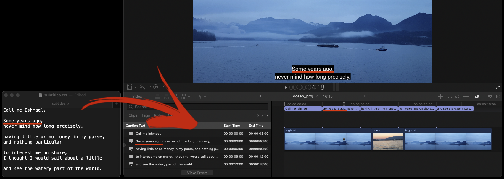

# Text to Video Markers FCP - Python



This python file **marks a video clip with comments** based on **human-written instructions** inside the FinalCut Pro video editor.

## 1. Table of Contents

- [Text to Video Markers FCP - Python](#text-to-video-markers-fcp---python)
  - [1. Table of Contents](#1-table-of-contents)
  - [2. Description](#2-description)
    - [2.1 Problem](#21-problem)
    - [2.2 Solution](#22-solution)
    - [2.3 Motivation behind the project](#23-motivation-behind-the-project)
    - [2.4 Development history](#24-development-history)
  - [3. Technologies Used](#3-technologies-used)
  - [4. Installation](#4-installation)
  - [5. Usage](#5-usage)
    - [5.1 Prepare and export .fcpxml file](#51-prepare-and-export-fcpxml-file)
      - [5.1.1 Create new project](#511-create-new-project)
      - [5.1.2 Create and compound clip and](#512-create-and-compound-clip-and)
      - [5.1.3 Export XML](#513-export-xml)
    - [5.2 Prepare .txt file](#52-prepare-txt-file)
      - [5.2.1 Write text instructions](#521-write-text-instructions)
      - [5.2.2 Rename and move .txt file](#522-rename-and-move-txt-file)
    - [5.3 Launch Python script](#53-launch-python-script)
    - [5.4 Open export.fcpxml with FinalCut Pro](#54-open-exportfcpxml-with-finalcut-pro)
  - [6. Project Status](#6-project-status)
  - [7. Known Limitations](#7-known-limitations)
  - [8. Room for Improvement](#8-room-for-improvement)
  - [9. License](#9-license)
  - [10. Contact](#10-contact)

<!-- * [License](#license) -->

## 2. Description

### 2.1 Problem

In a fast-paced TV, Film, and Video production environment **Video Editors** often receive stakeholder's notes in a **text format**. The notes would normally include a timestamp and a comment on what needs to be changed in a free form like:

```
1:02 switch angle here
14:05 replace this shot
```

In the case of Documentary films or long interviews, the length of the footage can be very long. And so do the notes.

### 2.2 Solution

Instead of manually selecting these clips in Video Editing Software or copy-pasting the one timecode at a time this script automatically adds comments to a single clip or compound clip in a form of markers inside FinalCut Pro based on stakeholder's notes, therefore, increasing productivity, precision, and eliminating mistakes. 

Once added, the markers stay attached to the actual clips no matter where those clips get moved. This eliminates the need for Video Editors to make edits from behind in order to preserve timings specified in stakeholders' notes. 

### 2.3 Motivation behind the project

I first created this workflow when I was Directing and Video Editing TV mini-series. Since deadlines were extremely tight I was looking at every opportunity to speed up the delivery times while maintaining high quality. I later used it for commercial Videography projects. This solution fits my workflow very well and has proven to be very useful.

### 2.4 Development history

It was originally built simply by using a stack of **regular expressions** executed in the TextSoap.app along with some operations in Excel and copy-pasting the code manually. Later most of the steps were combined in a single Python script that is presented here.

## 3. Technologies Used

- **`Python 3.9.4`**
- **`datetime`** integrated module to work with date and time
- **`re`** integrated regular expression operations module

## 4. Installation

Download **`text_to_video_markers.py`** file from this GitHub repository.

## 5. Usage

### 5.1 Prepare and export .fcpxml file

#### 5.1.1 Create new project

In FinalCut Pro create a `New Project` and load clips into the timeline. In a sample project, I duplicated the same clips to make the project over one hour long.

#### 5.1.2 Create and compound clip and 

Now `Select all`, choose `File -> New -> Compound Clip`, and make at least one cut of the newly created compound clip.


#### 5.1.3 Export XML

Choose `File -> Export XML`. Rename it to **`clip.fcpxml`** and save it in the same folder with `text_to_video_markers.py` file.


### 5.2 Prepare .txt file

#### 5.2.1 Write text instructions

**Write instructions** on where you want to place markers. The text:

- Must contain at least **one timecode in a line** either in `hh:mm:ss` or `mm:ss` format.
- Lines **without timecodes** will be moved to a previous line.
- Lines with **more than one timecodes** will use the first one and discard others.
- The **text** will be inserted as **markers' names**.

Here is a **sample** provided in this project:

```
0:01 camera shake here
music louder? 
00:2 a bit to dark here
0:3 try to change angle for 0:14 sec
from 03:07 cut out until 3:20 
04:17 fantastic shot!
4:31 add transition
1:4:40 add titles here
01:04:48 fade to black
```

As you can see the formatting can be quite loose.

#### 5.2.2 Rename and move .txt file

Paste the text into a text editor, then save it as `videomarkers.txt`, and move the file into the same folder `with clip.fcpxml` and `text_to_video_markers.py`.

### 5.3 Launch Python script

Open **Terminal.app**. Type `python`, add `space`, then drag and drop `text_to_video_markers.py` and press `Return`.


Alternatively you can instal the latest version of [Python](https://www.python.org/downloads/macOS). Right-click on `text_to_video_markers.py` file and choose `Open with -> Python Launcher.app`.


Either method will run the script and create `export.fcpxml` file in the same folder.
### 5.4 Open export.fcpxml with FinalCut Pro

Select newly created `export.fcpxml` file and `Open with -> FinalCut Pro`. Upon opening choose the original library, then `Keep Both`. This will create the second project with `your_original_name_1` that will include all the edits specified in `videomarkers.txt`.

**That's it!** We have just automatically created markers on a compound clip inside FinalCut Pro based on human-written text instructions.


## 6. Project Status

The project is: **_complete_**
I am no longer working on it since I am not working for TV any longer. But if you have some ideas or want me to modify something [contact me](#contact) and we should be able to collaborate.

## 7. Known Limitations

- The script only runs with **Python 3** installed.
- **`videomarkers.txt`** file must contain two or more **two timecodes** per line.
- .fcpxml must have one or more **markers**.
- Input files must be named **`clip.fcpxml`** and **`videomarkers.txt`**.
- All three files (`text_to_video_markers.py`, `clip.fcpxml`, `videomarkers.txt`) must be located in the **same folder**.
- Python launcher won't run
- Run with terminal?

## 8. Room for Improvement

- **Testing** and logging the issues.
- Adding support for compatibility with **multiple** distinct compound and regular clips.
- Making an **executable file** without the need to install `Python 3`.
- **Developing GUI** to be able to specify .txt and .fcpxml input files with any name and location.
- Building a **web app**.

## 9. License

This project is open-source and available under the [GNU General Public License v3.0](https://choosealicense.com/licenses/gpl-3.0/#)

## 10. Contact

Created by [@DmytroNorth](https://github.com/DmytroNorth) - feel free to contact me at dmytronorth@gmail.com!
